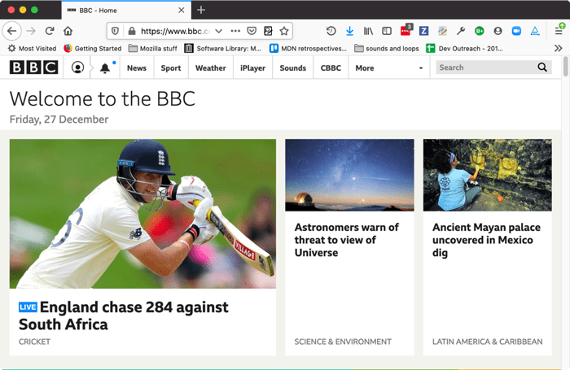

# WTF HTML极简教程: 6. Hyperlink 超链接

WTF HTML教程，总结/搬运自[MDN HTML教程]((https://developer.mozilla.org/zh-CN/docs/Learn/HTML))，帮助新人快速入门HTML。

**推特**：[@WTFAcademy_](https://twitter.com/WTFAcademy_)  ｜ [@0xAA_Science](https://twitter.com/0xAA_Science) 

**WTF Academy社群：** [官网 wtf.academy](https://wtf.academy) | [WTF Solidity教程](https://github.com/AmazingAng/WTFSolidity) | [discord](https://discord.wtf.academy) | [微信群申请](https://docs.google.com/forms/d/e/1FAIpQLSe4KGT8Sh6sJ7hedQRuIYirOoZK_85miz3dw7vA1-YjodgJ-A/viewform?usp=sf_link)

所有代码和教程开源在github: [github.com/WTFAcademy/WTF-HTML](https://github.com/WTFAcademy/WTF-HTML)

---

超链接非常重要 ——它们使互联网成为一个互联的网络。这一讲，我们介绍创建链接所需的语法以及不同种类链接的创建。


## 什么是超链接？

超链接是互联网提供的最令人兴奋的创新之一，它们从一开始就一直是互联网的一个特性，使互联网成为互联的网络。超链接使我们能够将我们的文档链接到任何其他文档（或其他资源），也可以链接到文档的指定部分，我们可以在一个简单的网址上提供应用程序（与必须先安装的本地应用程序或其他东西相比）。几乎任何网络内容都可以转换为链接，点击（或激活）超链接将使网络浏览器转到另一个网址（[URL](https://developer.mozilla.org/zh-CN/docs/Glossary/URL)）。

> **Note**
>
> URL 可以指向 HTML 文件、文本文件、图像、文本文档、视频和音频文件以及可以在网络上保存的任何其他内容。如果浏览器不知道如何显示或处理文件，它会询问你是否要打开文件（需要选择合适的本地应用来打开或处理文件）或下载文件（以后处理它）。

以 BBC 的主页为例，里面就包含了非常多的链接，各自连到不同新闻、网站的其它地方（导览功能），或者登入/注册页面（用户工具）等等。



## 链接的解析

通过将文本（或其它内容) 包裹在 `<a>` 元素内，并给它一个 [`href`](https://developer.mozilla.org/zh-CN/docs/Web/HTML/Element/a#attr-href) 属性（也称为**超文本引用**或**目标**，它将包含一个网址）来创建一个基本链接。

```html
<p>我创建了一个指向
  <a href="https://wtf.academy/">WTFAcademy 主页</a>的超链接。
</p>
```

结果如下所示：

<p>我创建了一个指向
  <a href="https://wtf.academy/">WTFAcademy 主页</a>的超链接。
</p>

### 使用 `title` 属性添加支持信息

你可能要添加到你的链接的另一个属性是 title（标题）；这旨在包含关于链接的补充信息，例如页面包含什么样的信息或需要注意的事情。

```html
<p>我创建了一个指向
  <a href="https://wtf.academy/" title="面向Web2开发者的Web3开源学院。">WTFAcademy 主页</a>的超链接。
</p>
```

结果如下（当鼠标指针悬停在链接上时，标题将作为提示信息出现）：

<p>我创建了一个指向
  <a href="https://wtf.academy/" title="面向Web2开发者的Web3开源学院。">WTFAcademy 主页</a>的超链接。
</p>

> **Note**
>
> 链接的标题仅当鼠标悬停在其上时才会显示，这意味着使用键盘来导航网页的人很难获取到标题信息。如果标题信息对于页面非常重要，你应该使用所有用户能都方便获取的方式来呈现，例如放在常规文本中。

## 不同种类的链接

### 链接到外部地址

<a href="https://wtf.academy/">外部链接</a>

```html
<a href="https://wtf.academy/">外部链接</a>
```

### 链接到本页的某个部分

<a href="#什么是超链接？">相同页面链接的描述</a>

```html
<a href="#什么是超链接？">相同页面链接的描述</a>
```

### 创建一个可点击的图片

<a href="https://wtf.academy/">
  
</a>

```html
<a href="https://wtf.academy/">
  
</a>
```

### 创建一个 email 链接

这是常见的创建按钮或链接，将用户的电子邮件程序打开，让他们发送新邮件。这是通过使用一个 mailto 链接完成的。这里有一个简单的例子：

<a href="mailto:nowhere@mozilla.org">Send email to nowhere</a>

```html
<a href="mailto:nowhere@mozilla.org">Send email to nowhere</a>
```

### 创建电话链接

<a href="tel:+491570156">+49 157 0156</a>

```html
<a href="tel:+491570156">+49 157 0156</a>
```

### 创建下载链接

<a href="./img/6-2.png" download="wtflogo">下载 WTFAcademy logo</a>

```html
<a href="./img/6-2.png" download="wtflogo">下载 WTFAcademy logo</a>
```

## 总结

这一讲我们介绍了超链接的概念，创建超链接使用的标签，以及不同种类的链接。
