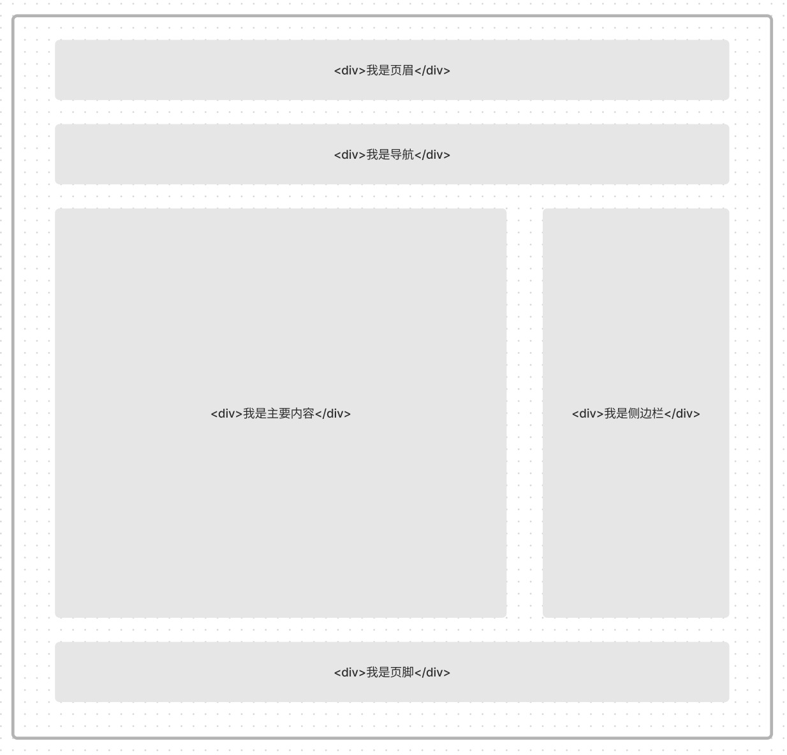
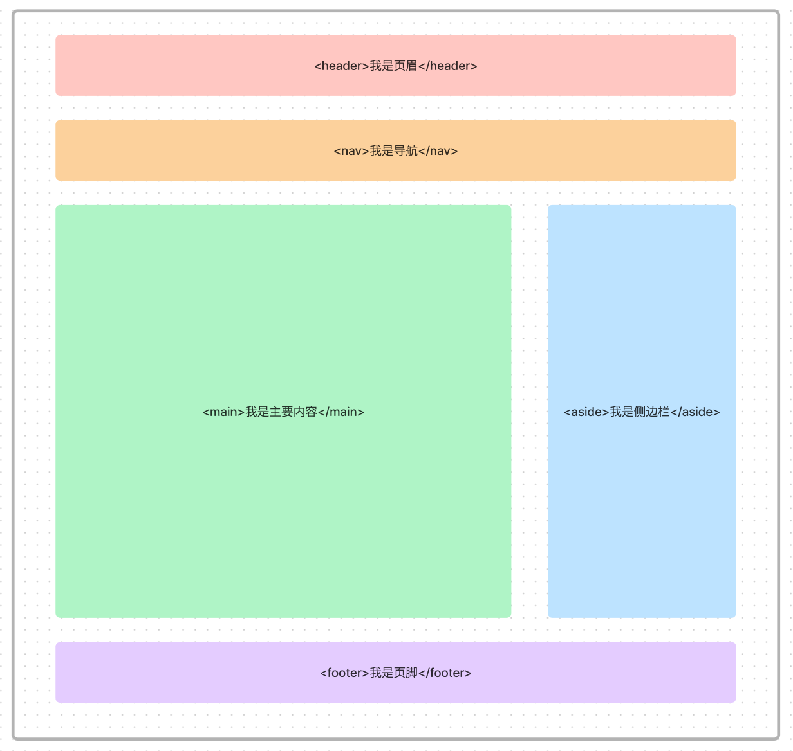

# WTF HTML极简教程: 8. 语义元素

WTF HTML教程，总结/搬运自[MDN HTML教程]((https://developer.mozilla.org/zh-CN/docs/Learn/HTML))，帮助新人快速入门HTML。

**推特**：[@WTFAcademy_](https://twitter.com/WTFAcademy_)  ｜ [@0xAA_Science](https://twitter.com/0xAA_Science) 

**WTF Academy社群：** [官网 wtf.academy](https://wtf.academy) | [WTF Solidity教程](https://github.com/AmazingAng/WTFSolidity) | [discord](https://discord.wtf.academy) | [微信群申请](https://docs.google.com/forms/d/e/1FAIpQLSe4KGT8Sh6sJ7hedQRuIYirOoZK_85miz3dw7vA1-YjodgJ-A/viewform?usp=sf_link)

所有代码和教程开源在github: [github.com/WTFAcademy/WTF-HTML](https://github.com/WTFAcademy/WTF-HTML)

---

这一讲，我们来学习一下如何在页面中让正确的元素做正确的事情。

## 什么是语义元素？

语义元素指的就是元素自身的含义。例如我们在第三讲中所学的 `<h1>` 元素，它被赋予的含义就是页面中的一级标题，很重要！

```html
<h1>我是一级标题，我很重要</h1>
```

浏览器在解析到上面这段代码时也会明白这个标题很重要。
在 HTML 中还有很多这样的语义元素，它们本身就具有不同的含义。
下来我们来介绍一下常用的语义元素。

## 常用的语义元素：

### 文本类：

`<h1>-<h6>` 用来表示页面中1-6级标题。

`<p>` 用来表示段落。

`<ol>` 表示有序列表。

`<ul>` 表示无序列表。

`<li>` 用于表示列表里的条目,通常放在 `<ol>` 、`<li>` 列表内。

### 页面布局类：

文本类语义元素很好理解，接下来让我们重点学习一下布局类语义元素。
一个页面结构通常包含：页眉、页脚、标题、导航、内容、侧边栏等等。
我们可以这样来编写页面。



如上图所示，只需要使用 `<div>` 元素就可以完成一个页面的布局。甚至文本内容，例如标题、段落等等，也可以使用 `<div>` 来编写。
但是这样会产生两个很明显问题：
1. 不利于开发人员编写代码，当你面对满屏幕的 `<div>` 元素时，你很难快速分清楚他们所代表的含义。
2. 不利于搜索引擎优化（SEO），机器只知道你用了 `<div>` 元素，而 `div` 元素本身不具有任何含义，它只是一个容器。

这时候我们可以通过使用语义元素来解决这两个问题，如下图所示。



我们分别使用了 `<header>`  `<nav>`  `<main>`  `<aside>`  `<footer>` 来分别表示页面中不同的区域。
使用这些标签让页面具有良好的语义和结构，从而方便开发人员和机器都能快速理解网页内容。
这并不表示你不可以使用 `<div>` 元素 来编写页面，只是我们可以在页面特定的内容上，可以使用一些语义元素来替代 `<div>` 元素。
这就是开头所说的让正确的元素做正确的事情。

下面我们来简单介绍一下这些标签。

`<header>` 用于展示介绍性内容，通常包含一组介绍性的或是辅助导航的实用元素。它可能包含一些标题元素，但也可能包含其他元素，比如 Logo、搜索框、作者名称，等等。

`<nav>` 表示页面的一部分，其目的是在当前文档或其他文档中提供导航链接。导航部分的常见示例是菜单，目录和索引。

`<main>` 呈现了文档的 body 或应用的主体部分。主体部分由与文档直接相关，或者扩展于文档的中心主题、应用的主要功能部分的内容组成。

`<aside>` 表示一个和其余页面内容几乎无关的部分，被认为是独立于该内容的一部分并且可以被单独的拆分出来而不会使整体受影响。其通常表现为侧边栏或者标注框。

`<footer>` 通常用来表示页脚。一个页脚通常包含该章节作者、版权数据或者与文档相关的链接等信息。

`<address>` 表示其中的 HTML 提供了某个人或某个组织（等等）的联系信息。

`<article>` 表示文档、页面、应用或网站中的独立结构，其意在成为可独立分配的或可复用的结构，如在发布中，它可能是论坛帖子、杂志或新闻文章、博客、用户提交的评论、交互式组件，或者其他独立的内容项目。​​

`<section>` 表示 HTML 文档中一个通用独立章节，它没有更具体的语义元素来表示。一般来说会包含一个标题。

了解更多[语义元素](https://developer.mozilla.org/zh-CN/docs/Web/HTML/Element)。


## 为什么需要语义元素？
1. 更便于开发 — 如上所述，你所编写的 HTML 代码更易于理解，可读性更高。
2. 方便其他设备解析（如屏幕阅读器、盲人阅读器、移动设备）以语义的方式来渲染网页。
3. 更便于 SEO 优化 — 比起使用非语义化的<div>标签，搜索引擎更加重视在“标题、链接等”里面的关键字，使用语义化可使网页更容易被用户搜索到。


## 总结

这一讲我们介绍了一些常用的语义元素，它们无论是对于开发者还是机器而言都是很重要的，在编写页面时我们要经常使用这些语义元素。